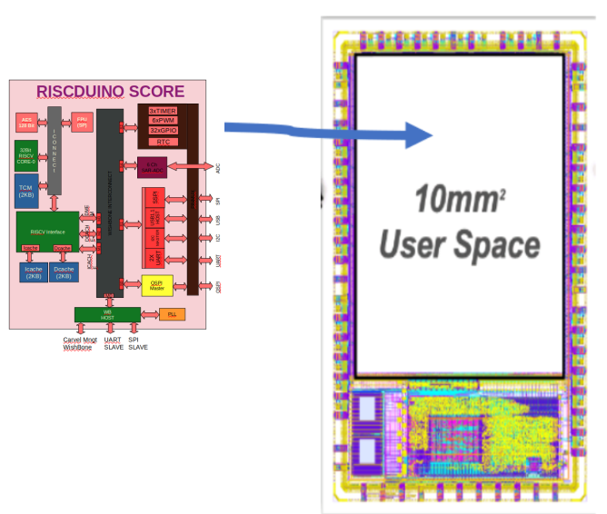
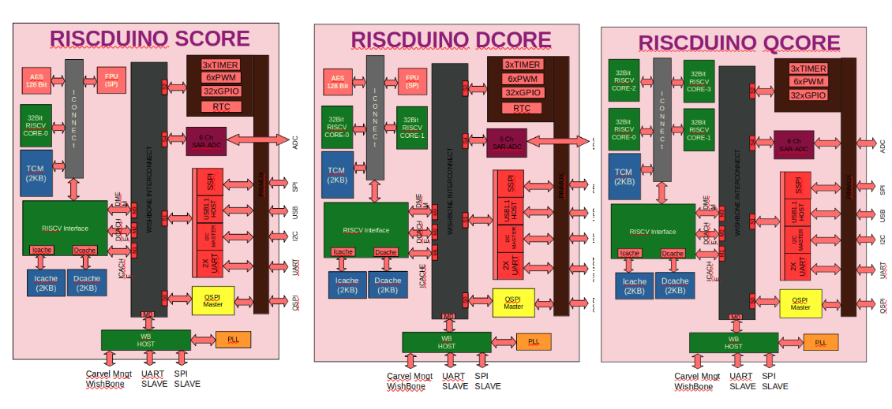
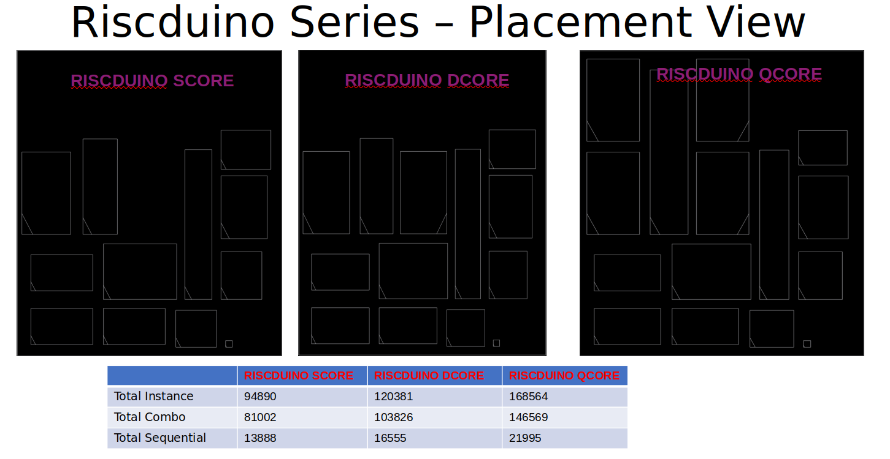
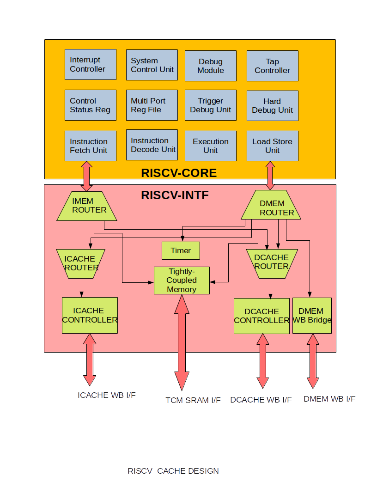
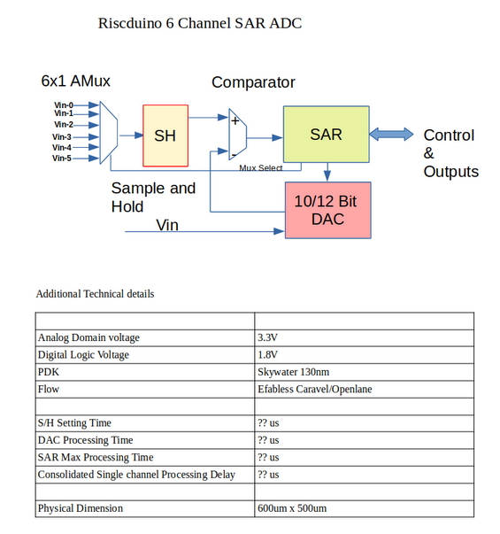

```
  Riscduino Single Risc Core SOC


Permission to use, copy, modify, and/or distribute this soc for any
purpose with or without fee is hereby granted, provided that the above
copyright notice and this permission notice appear in all copies.

THE SOC IS PROVIDED "AS IS" AND THE AUTHOR DISCLAIMS ALL WARRANTIES
WITH REGARD TO THIS SOC INCLUDING ALL IMPLIED WARRANTIES OF
MERCHANTABILITY AND FITNESS. IN NO EVENT SHALL THE AUTHOR BE LIABLE FOR
ANY SPECIAL, DIRECT, INDIRECT, OR CONSEQUENTIAL DAMAGES OR ANY DAMAGES
WHATSOEVER RESULTING FROM LOSS OF USE, DATA OR PROFITS, WHETHER IN AN
ACTION OF CONTRACT, NEGLIGENCE OR OTHER TORTIOUS ACTION, ARISING OUT OF
OR IN CONNECTION WITH THE USE OR PERFORMANCE OF THIS SOC.
```

# Table of contents
- [Overview](#overview)
- [Riscduino Block Diagram](#Riscduino-block-diagram)
- [Key Feature](#key-features)
- [Riscduino derivatives](#riscduino-derivatives)
- [MPW Shuttle on Riscduino](#mpw-shuttle-on-riscduino)
- [Sub IP Feature](#sub-ip-features)
- [SOC Memory Map](#soc-memory-map)
- [Pin Mapping](#soc-pin-mapping)
- [Repository contents](#repository-contents)
- [Prerequisites](#prerequisites)
- [Tests preparation](#tests-preparation)
    - [Test Cases](#test-cases)
    - [Running Simuation](#running-simulation)
- [Tool sets](#tool-sets)
- [News](#news)
- [Contacts](#contacts)
- [How To Contribute](#how-to-contribute)
- [Documentation](#documentation)


# Overview

Riscduino is a Single 32 bit RISC V based SOC design pin compatible to arduino platform and this soc targeted for efabless Shuttle program.  This project uses only open source tool set for simulation,synthesis and backend tools.  The SOC flow follow the openlane methodology and SOC environment is compatible with efabless/carvel methodology.
<table>
  <tr>
    <td  align="center"></td>
  </tr>

</table>
# Riscduino Block Diagram

<table>
  <tr>
    <td  align="center"></td>
  </tr>

</table>


# Key features
```
    * Open sourced under Apache-2.0 License (see LICENSE file) - unrestricted commercial use allowed.
    * Single 32 Bit RISC-V core
    * 2KB SRAM for instruction cache 
    * 2KB SRAM for data cache
    * 2KB SRAM for Tightly coupled memory - For Data Memory
    * Quad SPI Master with 4 Chip select, supports both SPI flash and SRAM interface
    * 2 x UART with 16Byte FIFO
    * USB 1.1 Host
    * I2C Master
    * UART Master
    * Simple SPI Master with 4 Chip select
    * 6 Channel ADC (in Progress)
    * 6 x PWM
    * 3 x Timer (16 Bit), 1us/1ms/1second resolution
    * 2 x ws281x driver
    * 16 Hardware Semaphore
    * FPU (SP) Core
    * AES 128 Bit Core
    * RTC Core
    * Pin Compatbible to arduino uno
    * Wishbone compatible design
    * Written in System Verilog
    * Open-source tool set
       * simulation - iverilog
       * synthesis  - yosys
       * backend/sta - openlane tool set
    * Verification suite provided.
```

# Riscduino derivatives

<table>
  <tr>
    <td  align="center"></td>
  </tr>
  <tr>
    <td  align="center"></td>
  </tr>

</table>

# MPW Shuttle on Riscduino 

<table>
  <tr>
    <td  align="center"> MPW</td> 
    <td  align="center"> Tape-out</td>
    <td  align="center"> Project Name</td>
    <td  align="center"> Project Details</td>
    <td  align="center"> Github</td>
    <td  align="center"> Efabless</td>
    <td  align="center"> Tapeout Link</td>
  </tr>
  <tr>
    <td  align="center"> MPW-2 </td> 
    <td  align="center"> 18-June-2021  </td>
    <td  align="center"> YiFive</td>
    <td  align="center"> Single 32bit RISCV core without cache + SDRAM Controller + WB Interconnect</td>
    <td  align="center"> <a href="https://github.com/dineshannayya/yifive">Link</a></td>
    <td  align="center"> <a href="https://platform.efabless.com/projects/152">Link</a></td>
    <td  align="center"> <a https://foss-eda-tools.googlesource.com/third_party/shuttle/sky130/mpw-002/slot-007">Link</a></td>
  </tr>
  <tr>
    <td  align="center"> MPW-3 </td> 
    <td  align="center"> 15-Nov-2021  </td>
    <td  align="center"> Riscduino</td>
    <td  align="center"> Single 32bit RISCV core without cache + Onchip SRAM + WB Interconnect</td>
    <td  align="center"> <a href="https://github.com/dineshannayya/riscduino">Link</a></td>
    <td  align="center"> <a href="https://platform.efabless.com/projects/385">Link</a></td>
    <td  align="center"> <a href="https://foss-eda-tools.googlesource.com/third_party/shuttle/sky130/mpw-003/slot-013">Link</a></td>
  </tr>
  <tr>
    <td  align="center"> MPW-4 </td> 
    <td  align="center"> 31-Dec-2021  </td>
    <td  align="center"> Riscduino-R1</td>
    <td  align="center"> Single 32bit RISCV core with cache + Onchip SRAM + WB Inter Connect</td>
    <td  align="center"> <a href="https://github.com/dineshannayya/riscduino">Link</a></td>
    <td  align="center"> <a href="https://platform.efabless.com/projects/575">Link</a></td>
    <td  align="center"> <a https://foss-eda-tools.googlesource.com/third_party/shuttle/sky130/mpw-004/slot-014">Link</a></td>
  </tr>
  <tr>
    <td  align="center"> MPW-5 </td> 
    <td  align="center"> 21-Mar-2022  </td>
    <td  align="center"> Riscduino-DCORE (D0)</td>
    <td  align="center"> Dual 32bit RISCV core with cache + Onchip SRAM+ WB Cross Bar</td>
    <td  align="center"> <a href="https://github.com/dineshannayya/riscduino_dcore">Link</a></td>
    <td  align="center"> <a href="https://platform.efabless.com/projects/718">Link</a></td>
    <td  align="center"> <a href="https://foss-eda-tools.googlesource.com/third_party/shuttle/sky130/mpw-005/slot-013">Link</a></td>
  </tr>
  <tr>
    <td  align="center"> MPW-5 </td> 
    <td  align="center"> 21-Mar-2022  </td>
    <td  align="center"> Riscduino-QCORE (Q0)</td>
    <td  align="center"> Quad 32bit RISCV core with cache + Onchip SRAM+ WB Cross Bar</td>
    <td  align="center"> <a href="https://github.com/dineshannayya/riscduino_qcore">Link</a></td>
    <td  align="center"> <a href="https://platform.efabless.com/projects/782">Link</a></td>
    <td  align="center"> <a href="https://foss-eda-tools.googlesource.com/third_party/shuttle/sky130/mpw-005/slot-014">Link</a></td>
  </tr>
  <tr>
    <td  align="center"> MPW-6 </td> 
    <td  align="center"> 07-June-2022  </td>
    <td  align="center"> Riscduino-SCORE (S3)</td>
    <td  align="center"> Single 32bit RISCV core with cache + Onchip SRAM+ WB Cross Bar</td>
    <td  align="center"> <a href="https://github.com/dineshannayya/riscduino">Link</a></td>
    <td  align="center"> <a href="https://platform.efabless.com/projects/1047">Link</a></td>
    <td  align="center"> <a href="https://foss-eda-tools.googlesource.com/third_party/shuttle/sky130/mpw-006/slot-006">Link</a></td>
  </tr>
  <tr>
    <td  align="center"> MPW-6 </td> 
    <td  align="center"> 07-June-2022  </td>
    <td  align="center"> Riscduino-DCORE (D1)</td>
    <td  align="center"> Dual 32bit RISCV core with cache + Onchip SRAM+ WB Cross Bar</td>
    <td  align="center"> <a href="https://github.com/dineshannayya/riscduino_dcore">Link</a></td>
    <td  align="center"> <a href="https://platform.efabless.com/projects/838">Link</a></td>
    <td  align="center"> <a href="https://foss-eda-tools.googlesource.com/third_party/shuttle/sky130/mpw-006/slot-004">Link</a></td>
  </tr>
  <tr>
    <td  align="center"> MPW-6 </td> 
    <td  align="center"> 07-June-2022 </td>
    <td  align="center"> Riscduino-QCORE (Q1)</td>
    <td  align="center"> Quad 32bit RISCV core with cache + Onchip SRAM+ WB Cross Bar</td>
    <td  align="center"> <a href="https://github.com/dineshannayya/riscduino_qcore">Link</a></td>
    <td  align="center"> <a href="https://platform.efabless.com/projects/839">Link</a></td>
    <td  align="center"> <a href="https://foss-eda-tools.googlesource.com/third_party/shuttle/sky130/mpw-006/slot-005">Link</a></td>
  </tr>
  <tr>
    <td  align="center"> MPW-7 </td> 
    <td  align="center"> 12-Sept-2022  </td>
    <td  align="center"> Riscduino-SCORE (S4)</td>
    <td  align="center"> Single 32bit RISCV core with cache + Onchip SRAM+ WB Cross Bar</td>
    <td  align="center"> <a href="https://github.com/dineshannayya/riscduino">Link</a></td>
    <td  align="center"> <a href="https://platform.efabless.com/projects/1166">Link</a></td>
    <td  align="center"> <a href="https://foss-eda-tools.googlesource.com/third_party/shuttle/sky130/mpw-007/slot-008">Link</a></td>
  </tr>
  <tr>
    <td  align="center"> MPW-7 </td> 
    <td  align="center"> 12-Sept-2022  </td>
    <td  align="center"> Riscduino-DCORE (D3)</td>
    <td  align="center"> Dual 32bit RISCV core with cache + Onchip SRAM+ WB Cross Bar</td>
    <td  align="center"> <a href="https://github.com/dineshannayya/riscduino_dcore">Link</a></td>
    <td  align="center"> <a href="https://platform.efabless.com/projects/1167">Link</a></td>
    <td  align="center"> <a href="https://foss-eda-tools.googlesource.com/third_party/shuttle/sky130/mpw-007/slot-006">Link</a></td>
  </tr>
  <tr>
    <td  align="center"> MPW-7 </td> 
    <td  align="center"> 12-Sept-2022 </td>
    <td  align="center"> Riscduino-QCORE (Q1)</td>
    <td  align="center"> Quad 32bit RISCV core with cache + Onchip SRAM+ WB Cross Bar</td>
    <td  align="center"> <a href="https://github.com/dineshannayya/riscduino_qcore">Link</a></td>
    <td  align="center"> <a href="https://platform.efabless.com/projects/1168">Link</a></td>
    <td  align="center"> <a href="https://foss-eda-tools.googlesource.com/third_party/shuttle/sky130/mpw-007/slot-007">Link</a></td>
  </tr>
</table>

# SOC Pin Mapping
Carvel SOC provides 38 GPIO pins for user functionality. Riscduino SOC GPIO Pin Mapping as follows vs ATMEGA328 and Arudino
<table>
  <tr>
    <td  align="center"></td>
  </tr>

</table>

<table>
  <tr align="center"> <td> ATMGA328 Pin No</td> <td> Functionality           </td> <td> Arudino Pin Name</td> <td> Carvel Pin Mapping                   </td></tr>
  <tr align="center"> <td> Pin-1           </td> <td> PC6/RESET              </td> <td>                 </td> <td> digital_io[5]                        </td></tr>
  <tr align="center"> <td> Pin-2           </td> <td> PD0/RXD[0]             </td> <td>  D0             </td> <td> digital_io[6]                        </td></tr>
  <tr align="center"> <td> Pin-3           </td> <td> PD1/TXD[0]             </td> <td>  D1             </td> <td> digital_io[7]/analog_io[0]           </td></tr>
  <tr align="center"> <td> Pin-4           </td> <td> PD2/RXD[1]/INT0        </td> <td>  D2             </td> <td> digital_io[8]/analog_io[1]           </td></tr>
  <tr align="center"> <td> Pin-5           </td> <td> PD3/INT1/OC2B(PWM0)    </td> <td>  D3             </td> <td> digital_io[9]/analog_io[2]           </td></tr>
  <tr align="center"> <td> Pin-6           </td> <td> PD4/TXD[1]             </td> <td>  D4             </td> <td> digital_io[10]/analog_io[3]          </td></tr>
  <tr align="center"> <td> Pin-7           </td> <td> VCC                    </td> <td>                 </td> <td>  -                                   </td></tr>
  <tr align="center"> <td> Pin-8           </td> <td> GND                    </td> <td>                 </td> <td>  -                                   </td></tr>
  <tr align="center"> <td> Pin-9           </td> <td> PB6/XTAL1/TOSC1        </td> <td>                 </td> <td> digital_io[11]/analog_io[4]          </td></tr>
  <tr align="center"> <td> Pin-10          </td> <td> PB7/XTAL2/TOSC2        </td> <td>                 </td> <td> digital_io[12]/analog_io[5]          </td></tr>
  <tr align="center"> <td> Pin-11          </td> <td> PD5/SS[3]/OC0B(PWM1)/T1      </td> <td> D5        </td> <td> digital_io[13]/analog_io[6]          </td></tr>
  <tr align="center"> <td> Pin-12          </td> <td> PD6/SS[2]/OC0A(PWM2)/AIN0    </td> <td> D6        </td> <td> digital_io[14]/analog_io[7]          </td></tr>
  <tr align="center"> <td> Pin-13          </td> <td> PD7/A1N1               </td> <td> D7              </td> <td> digital_io[15]/analog_io[8]          </td></tr>
  <tr align="center"> <td> Pin-14          </td> <td> PB0/CLKO/ICP1          </td> <td> D8              </td> <td> digital_io[16]/analog_io[9]          </td></tr>
  <tr align="center"> <td> Pin-15          </td> <td> PB1/SS[1]OC1A(PWM3)         </td> <td> D9         </td> <td> digital_io[17]/analog_io[10]         </td></tr>
  <tr align="center"> <td> Pin-16          </td> <td> PB2/SS[0]/OC1B(PWM4)      </td> <td> D10          </td> <td> digital_io[18]/analog_io[11]         </td></tr>
  <tr align="center"> <td> Pin-17          </td> <td> PB3/MOSI/OC2A(PWM5)    </td> <td> D11             </td> <td> digital_io[19]/analog_io[12]         </td></tr>
  <tr align="center"> <td> Pin-18          </td> <td> PB4/MISO               </td> <td> D12             </td> <td> digital_io[20]/analog_io[13]         </td></tr>
  <tr align="center"> <td> Pin-19          </td> <td> PB5/SCK                </td> <td> D13             </td> <td> digital_io[21]/analog_io[14]         </td></tr>
  <tr align="center"> <td> Pin-20          </td> <td> AVCC                   </td> <td>                 </td> <td> -                                    </td></tr>
  <tr align="center"> <td> Pin-21          </td> <td> AREF                   </td> <td>                 </td> <td> analog_io[23]                        </td></tr>
  <tr align="center"> <td> Pin-22          </td> <td> GND                    </td> <td>                 </td> <td> -                                    </td></tr>
  <tr align="center"> <td> Pin-23          </td> <td> PC0/uartm_rxd/ADC0     </td> <td>  A0             </td> <td> digital_io[22]/analog_io[15]         </td></tr>
  <tr align="center"> <td> Pin-24          </td> <td> PC1/uartm/ADC1         </td> <td>  A1             </td> <td> digital_io[23]/analog_io[16]         </td></tr>
  <tr align="center"> <td> Pin-25          </td> <td> PC2/usb_dp/ADC2        </td> <td>  A2             </td> <td> digital_io[24]/analog_io[17]         </td></tr>
  <tr align="center"> <td> Pin-26          </td> <td> PC3/usb_dn/ADC3        </td> <td>  A3             </td> <td> digital_io[25]/analog_io[18]         </td></tr>
  <tr align="center"> <td> Pin-27          </td> <td> PC4/ADC4/SDA           </td> <td>  A4             </td> <td> digital_io[26]/analog_io[19]         </td></tr>
  <tr align="center"> <td> Pin-28          </td> <td> PC5/ADC5/SCL           </td> <td>  A5             </td> <td> digital_io[27]/analog_io[20]         </td></tr>
  <tr align="center"> <td colspan="4">   Additional Pad used for Externam ROM/RAM/USB </td></tr>
  <tr align="center"> <td> Sflash          </td> <td> sflash_sck             </td> <td>                 </td> <td> digital_io[28]/Analog[21]            </td></tr>
  <tr align="center"> <td> SFlash          </td> <td> sflash_ss0             </td> <td>                 </td> <td> digital_io[29]/Analog[22]            </td></tr>
  <tr align="center"> <td> SFlash          </td> <td> sflash_ss1/AREF        </td> <td>                 </td> <td> digital_io[30]/Analog[23]            </td></tr>
  <tr align="center"> <td> SFlash          </td> <td> sflash_ss2             </td> <td>                 </td> <td> digital_io[31]/Analog[24]            </td></tr>
  <tr align="center"> <td> SFlash          </td> <td> sflash_ss3             </td> <td>                 </td> <td> digital_io[32]/Analog[25]            </td></tr>
  <tr align="center"> <td> SFlash          </td> <td> sflash_io0             </td> <td>                 </td> <td> digital_io[33]/Analog[26]            </td></tr>
  <tr align="center"> <td> SFlash          </td> <td> sflash_io1             </td> <td>                 </td> <td> digital_io[34]/Analog[27]            </td></tr>
  <tr align="center"> <td> SFlash          </td> <td> sflash_io2             </td> <td>                 </td> <td> digital_io[35]/Analog[28]            </td></tr>
  <tr align="center"> <td> SFlash          </td> <td> sflash_io3             </td> <td>                 </td> <td> digital_io[36]                       </td></tr>
  <tr align="center"> <td> DEBUG           </td> <td> dbg_clk_mon            </td> <td>                 </td> <td> digital_io[37]                       </td></tr>
  <tr align="center"> <td> SPARE           </td> <td> PA0                    </td> <td>                 </td> <td> digital_io[0]                       </td></tr>
  <tr align="center"> <td> SPARE           </td> <td> PA1                    </td> <td>                 </td> <td> digital_io[1]                       </td></tr>
  <tr align="center"> <td> SPARE           </td> <td> PA2                    </td> <td>                 </td> <td> digital_io[2]                       </td></tr>
  <tr align="center"> <td> SPARE           </td> <td> PA3                    </td> <td>                 </td> <td> digital_io[3]                       </td></tr>
  <tr align="center"> <td> SPARE           </td> <td> PA4                     </td> <td>                </td> <td> digital_io[4]                       </td></tr>
</table>


# Riscduino documentation
*  Riscduino documentation available at : <https://riscduino.readthedocs.io/en/latest/>

# Arduino ide integration
*  We are in initial phase of Riscduino board integration into arduino and integration details are available at : <https://github.com/dineshannayya/riscduino_board/>


# Sub IP features

## RISC V Core

Riscduino SOC Integrated 32 Bits RISC V core. Initial version of Single core RISC-V core is picked from 
Syntacore SCR1 (https://github.com/syntacore/scr1)
### RISC V core customization for Riscduino SOC
Following Design changes are done on the basic version of syntacore RISC core
```
   * Some of the sv syntex are changed to standard verilog format to make compatibile with opensource tool iverilog & yosys
   * local Instruction Memory depth increased from 4 to 8 location
   * Instruction Mem Request are changed from Single word to 4 Word Burst
   * Multiplication and Divsion are changed to improve timing
   * Additional pipe line stages added to improve the RISC timing closure near to 50Mhz
   * 2KB instruction cache 
   * 2KB data cache
   * Additional router are added towards instruction cache
   * Additional router are added towards data cache
   * Modified AXI/AHB interface to wishbone interface for instruction and data memory interface
```
### Block Diagram
<table>
  <tr>
    <td  align="center"></td>
  </tr>
</table>

### RISC V Core Key feature
```
   * RV32I or RV32E ISA base + optional RVM and RVC standard extensions
   * Machine privilege mode only
   * 2 to 5 stage pipeline
   * 2KB icache
   * 2KB dcache
   * Optional Integrated Programmable Interrupt Controller with 16 IRQ lines
   * Optional RISC-V Debug subsystem with JTAG interface
   * Optional on-chip Tightly-Coupled Memory
```


# 6 Channel SAR ADC
 In Process - Looking for community help ...

<table>
  <tr>
    <td  align="center"></td>
  </tr>

</table>

# SOC Memory Map

<table>
  <tr>
    <td  align="center"> RISC IMEM</td> 
    <td  align="center"> RISC DMEM</td>
    <td  align="center"> EXT MAP</td>
    <td  align="center"> Target IP</td>
  </tr>
  <tr>
    <td  align="center"> 0x0000_0000 to 0x0FFF_FFFF  </td> 
    <td  align="center"> 0x0000_0000 to 0x0FFF_FFFF  </td>
    <td  align="center"> 0x0000_0000 to 0x0FFF_FFFF</td>
    <td  align="center"> QSPI FLASH MEMORY</td>
  </tr>
  <tr>
    <td  align="center"> 0x1000_0000 to 0x1000_00FF</td> 
    <td  align="center"> 0x1000_0000 to 0x1000_00FF</td>
    <td  align="center"> 0x1000_0000 to 0x1000_00FF</td>
    <td  align="center"> QSPI Config Reg</td>
  </tr>
  <tr>
    <td  align="center"> 0x1001_0000 to 0x1001_003F</td> 
    <td  align="center"> 0x1001_0000 to 0x1001_003F</td>
    <td  align="center"> 0x1001_0000 to 0x1001_003F</td>
    <td  align="center"> UART</td>
  </tr>
  <tr>
    <td  align="center"> 0x1001_0040 to 0x1001_007F</td> 
    <td  align="center"> 0x1001_0040 to 0x1001_007F</td>
    <td  align="center"> 0x1001_0040 to 0x1001_007F</td>
    <td  align="center"> I2C</td>
  </tr>
  <tr>
    <td  align="center"> 0x1001_0080 to 0x1001_00BF</td> 
    <td  align="center"> 0x1001_0080 to 0x1001_00BF</td>
    <td  align="center"> 0x1001_0080 to 0x1001_00BF</td>
    <td  align="center"> USB</td>
  </tr>
  <tr>
    <td  align="center"> 0x1001_00C0 to 0x1001_00FF</td> 
    <td  align="center"> 0x1001_00C0 to 0x1001_00FF</td>
    <td  align="center"> 0x1001_00C0 to 0x1001_00FF</td>
    <td  align="center"> SSPI</td>
  </tr>
  <tr>
    <td  align="center"> 0x1001_01C0 to 0x1001_013F</td> 
    <td  align="center"> 0x1001_01C0 to 0x1001_013F</td>
    <td  align="center"> 0x1001_01C0 to 0x1001_013F</td>
    <td  align="center"> SSPI</td>
  </tr>
  <tr>
    <td  align="center"> 0x1002_0080 to 0x1002_00FF</td> 
    <td  align="center"> 0x1002_0080 to 0x1002_00FF</td>
    <td  align="center"> 0x1002_0080 to 0x1002_00FF</td>
    <td  align="center"> PINMUX</td>
  </tr>
  <tr>
    <td  align="center"> -</td> 
    <td  align="center"> -</td>
    <td  align="center"> 0x3080_0000 to 0x3080_00FF</td>
    <td  align="center"> WB HOST</td>
  </tr>
</table>

# SOC Size

| Block             | Total Cell | Combo   | Seq      |
| ------            | ---------  | -----   | -------- |
| RISC              |  47218     | 41230   | 5988     |
| QSPI              |  9039      |  7526   | 1513     |
| UART_I2C_USB_SPI  | 11793      |  8932   | 2861     |
| WB_HOST           |  6508      |  5356   | 1152     |
| WB_INTC           |  6949      |  5538   | 1411     |
| PINMUX            | 11932      |  9327   | 2605     |
| PERIPHERAL        |  5852      |  4791   | 1061     |
| FPU               | 12831      | 11394   | 1437     |
| AES               | 21549      | 17960   | 3589     |
| BUS-REPEATER      |   922      |   922   | 0        |
|                   |            |         |          |
| TOTAL             | 134593     | 112976  | 21617    |


# Prerequisites
   - Docker (ensure docker daemon is running) -- tested with version 19.03.12, but any recent version should suffice.
## Step-1: Docker in ubuntu 20.04 version
```bash
   sudo apt update
   sudo apt-get install apt-transport-https curl rtificates -agent software-properties-common
   curl -fsSL https://download.docker.com/linux/ubuntu/gpg | sudo apt-key add -
   sudo add-apt-repository "deb [arch=amd64] https://download.docker.com/linux/ubuntu focal stable"
   sudo apt update
   apt-cache policy docker-ce
   sudo apt install docker-ce

   #Add User Name to docker
   sudo usermod -aG docker <your user name>
   # Reboot the system to enable the docker setup
```
##  Step-2: Clone , update the Submodule, unzip the content
```bash
   git clone https://github.com/dineshannayya/riscduino.git
   cd riscduino
   git submodule init
   git submodule update
   make unzip
```

## Note-1: RTL to GDS Docker
    - Required openlane and pdk are moved inside the riscduino docker to avoid the external dependency. 
    - flow automatically pull the required docker based on MPW version.
    - RTL to gds docker is hardcoded inside File: openlane/Makefile
```bash
     OPENLANE_TAG = mpw7
     OPENLANE_IMAGE_NAME = riscduino/openlane:$(OPENLANE_TAG)
```
## Note-1.1: View the RTL to GDS Docker content
    - for MPW-7 caravel pdk and openlane avaible inside riscduino/openlane:mpw7 docker 
    - caravel, openlane and pdk envionment are automatically pointed to internal docker pointer
    - To view the docker contents
```bash
    docker run -ti --rm riscduino/openlane:mpw7  bash
    cd /opt/pdk_mpw7     -  pdk folder
    cd /opt/caravel      -  caravel folder 
    cd /openlane         -  openlane folder
    env   - Show the internally defined env's
        CARAVEL_ROOT=/opt/caravel
        PDK_ROOT=/opt/pdk_mpw6
```

## Note-2: RTL Simulation Docker
    - Required caravel and pdk are moved inside the riscduino docker to avoid the external dependency. 
    - flow automatically pull the required docker based on MPW version.
    - To view the docker contents
    - RTL simulation docker hardcoded inside File: Makefile
        simenv:
	    docker pull riscduino/dv_setup:mpw6

## Note-2.1: View the RTL Simulation Docker content
    - for MPW-7 caravel and pdk avaible inside riscduino/dv_setup:mpw7 docker this is used for RTL to gds flows
    - caravel and pdk envionment are automatically pointed to internal docker pointer
    - To view the docker contents
```bash
    docker run -ti --rm riscduino/dv_setup:mpw7  bash
    cd /opt/pdk_mpw7     -  pdk folder
    cd /opt/caravel      -  caravel folder 
    env   - Show the internally defined env's
        CARAVEL_ROOT=/opt/caravel
        PDK_ROOT=/opt/pdk_mpw6
```

# Tests preparation

The simulation package includes the following tests:

## Standalone Riscduino SOC Specific Test case 
* **1.user_basic**             - Basic test case to validate strap and clocks
* **2.user_uart**              - Standalone Risc with UART-0 Test
* **3.user_uart1**             - Standalone Risc with UART-1 Test
* **4.user_risc_boot**         - Standalone User Risc core boot
* **4.risc_boot**              - Complete caravel User Risc core boot 
* **5.user_qspi**              - Standalone Quad SPI test
* **6.user_sspi**              - Standalone SSPI test
* **7.user_i2c**               - Standalone I2C test
* **8.user_usb**               - Standalone USB Host test
* **9.user_gpio**              - Standalone GPIO Test
* **10.user_aes**              - AES computation through Riscv core
* **11.user_spi_isp**          - Device boot with SPI as ISP
* **12.user_timer**            - Standalone timer Test
* **13.user_uart_master**      - Standalone uart master test
* **14.user_sram_exec**        - Riscv Boot with code running in SRAM
* **15.user_cache_bypass**     - Riscv Boot without icache and dcache
* **16.user_pwm**               -Standalone pwm Test
* **17.user_sema**              -Standalone validation of hardware Semaphore function
* **18.riscv_regress**          -Standalone riscv compliance and regression test suite
* **19.user_rtc**               -Standalone RTC core test
* **20.user_aes_core**          -Standalone AES Core test
* **21.user_fpu_core**          -Standalone FPU(SP) Core test
* **22.user_rtc**               -Standalone RTC core test
* **24.user_ir_tx**             -Standalone IR Transmitted Test
* **25.user_ir_rx**             -Standalone IR Receiver Test
* **26.user_random**            - User Random core test
* **27.step_motor_controller**  - Standalone Stepper Motor Controller

## Caravel+RISCDUINO Integrated Specific Test case 
* **1.wb_port**             - Complete caravel User Wishbone validation
* **2.uart_master_test1**   - complete caravel user uart master test with baud control from LA port
* **3.uart_master_test2**   - complete caravel user uart master test based on auto baud detection
* **4.risc_boot**           - Complete caravel User Risc core boot 
* **5.caravel_hkspi**       - Caravel House Keeping SPI test case

## Arduino Based Test Case
* **1.arduino_arrays**                - Validation of Array function
* **2.arduino_digital_port_control**  - Validation for AD5206 digital potentiometer through SPI
* **3.arduino_i2c_scaner**            - I2C port scanner        
* **4.arduino_risc_boot**             - Riscv Basic Boot
* **5.arduino_timer_intr**            - Timer Interrupt handling
* **6.arduino_ascii_table**           - Ascii Table Display
* **7.arduino_gpio_intr**             - GPIO Interrupt generation
* **8.arduino_i2c_wr_rd**             - I2C Write and Read access
* **9.arduino_string**                - Validation of String function
* **10.arduino_ws281x**               - Validation of ws281x serial protocol 
* **11.arduino_character_analysis**   - uart Input Character analysis
* **12.arduino_hello_world**          - Basic hello world display
* **13.arduino_multi_serial**         - Validation of Two Serail port
* **14.arduino_switchCase2**          - Validation of switch case

# Running Simulation

Examples:
``` sh
    make verify-wb_port                        - User Wishbone Test from caravel
    make verify-risc_boot                      - User Risc core test from caravel
    make verify-uart_master                    - User uart master test from caravel
    make verify-user_basic                     - Standalone Basic signal and clock divider test
    make verify-user_uart                      - Standalone user uart-0 test using user risc core
    make verify-user_uart1                     - Standalone user uart-0 test using user risc core
    make verify-user_i2cm                      - Standalone user i2c test
    make verify-user_risc_boot                 - standalone user risc core-0 boot test
    make verify-user_pwm                       - standalone user pwm test
    make verify-user_timer                     - standalone user timer test
    make verify-user_sspi                      - standalone user spi test
    make verify-user_qspi                      - standalone user quad spi test
    make verify-user_usb                       - standalone user usb host test
    make verify-user_gpio                      - standalone user gpio test
    make verify-user_aes                       - standalone aes test with risc core-0
    make verify-user_cache_bypass              - standalone icache and dcache bypass test with risc core-0
    make verify-user_uart_master               - standalone user uart master test
    make verify-user_sram_exec                 - standalone riscv core-0 test with executing code from data memory
    make verify-riscv_regress                  - standalone riscv compliance test suite
    make verify-arduino_risc_boot              - standalone riscv core-0 boot using arduino tool set
    make verify-arduino_hello_world            - standalone riscv core-0 hello world test using arduino tool set
    make verify-arduino_digital_port_control   - standalone riscv core-0 digital port control using arduino tool set
    make verify-arduino_ascii_table            - standalone riscv core-0 ascii table using arduino tool set
    make verify-arduino_character_analysis     - standalone riscv core-0 character analysis using arduino tool set
    make verify-arduino_multi_serial           - standalone riscv core-0 multi uart test using arduino tool set
    make verify-arduino_switchCase2            - standalone riscv core-0 switch case using arduino tool set
    make verify-arduino_risc_boot              - standalone riscv core-0 boot test using arduino tool set
    make verify-arduino_string                 - standalone riscv core-0 string usage test using arduino tool set

   
    make verify-user_uart SIM=RTL DUMP=OFF     - Standalone user uart-0 test using user risc core with waveform dump off
    make verify-user_uart SIM=RTL DUMP=ON      - Standalone user uart-0 test using user risc core with waveform dump on
    make verify-user_uart SIM=GL DUMP=OFF      - Standalone user uart-0 test using user risc core with gatelevel netlist
    make verify-user_uart SIM=GL DUMP=ON       - Standalone user uart-0 test using user risc core with gatelevel netlist and waveform on

```
# Running RTL to GDS flows
   - First run the individual macro file
   - Last run the user_project_wrapper
``` sh
   cd openlane
   make pinmux
   make qspim_top
   make uart_i2cm_usb_spi_top
   make wb_host
   make wb_interconnect
   make ycr_intf
   make ycr_core_top
   make ycr_iconnect
   make user_project_wrapper
```

#Timing Analysis
## Timing Analysis setup
   
``` sh
   make setup-timing-scripts
   make install
   make install_mcw
```
his will update Caravel design files and install the scripts for running timing.

## Running Timing Analysis

``` sh
make extract-parasitics
make create-spef-mapping
make caravel-sta
```
#Other Miscellaneous Targets
The makefile provides a number of useful that targets that can run LVS, DRC, and XOR checks on your hardened design outside of openlane’s flow.

Run make help to display available targets.

Run lvs on the mag view,

``` sh
make lvs-<macro_name>
```

Run lvs on the gds,

``` sh
make lvs-gds-<macro_name>
```

Run lvs on the maglef,

``` sh
make lvs-maglef-<macro_name>
```

Run drc using magic,

``` sh
make drc-<macro_name>
```

Run antenna check using magic,

``` sh
make antenna-<macro_name>
```

Run XOR check,

``` sh
make xor-wrapper
```


# Tool Sets

Riscduino Soc flow uses Openlane tool sets.

1. **Synthesis**
    1. `yosys` - Performs RTL synthesis
    2. `abc` - Performs technology mapping
    3. `OpenSTA` - Pefroms static timing analysis on the resulting netlist to generate timing reports
2. **Floorplan and PDN**
    1. `init_fp` - Defines the core area for the macro as well as the rows (used for placement) and the tracks (used for routing)
    2. `ioplacer` - Places the macro input and output ports
    3. `pdn` - Generates the power distribution network
    4. `tapcell` - Inserts welltap and decap cells in the floorplan
3. **Placement**
    1. `RePLace` - Performs global placement
    2. `Resizer` - Performs optional optimizations on the design
    3. `OpenPhySyn` - Performs timing optimizations on the design
    4. `OpenDP` - Perfroms detailed placement to legalize the globally placed components
4. **CTS**
    1. `TritonCTS` - Synthesizes the clock distribution network (the clock tree)
5. **Routing**
    1. `FastRoute` - Performs global routing to generate a guide file for the detailed router
    2. `CU-GR` - Another option for performing global routing.
    3. `TritonRoute` - Performs detailed routing
    4. `SPEF-Extractor` - Performs SPEF extraction
6. **GDSII Generation**
    1. `Magic` - Streams out the final GDSII layout file from the routed def
    2. `Klayout` - Streams out the final GDSII layout file from the routed def as a back-up
7. **Checks**
    1. `Magic` - Performs DRC Checks & Antenna Checks
    2. `Klayout` - Performs DRC Checks
    3. `Netgen` - Performs LVS Checks
    4. `CVC` - Performs Circuit Validity Checks


# News
* **Riscduino Aim** - <https://www.youtube.com/watch?v=lFVnicPhTI0>

# How To Contribute

We are looking for community help in following activity, interested user can ping me in efabless slack platform

*  **Analog Design**           - ADC, DAC, PLL,
*  **Digital Design**          - New IP Integration, Encription,DSP, DMA controller, 10Mb MAC, Floating point functions
*  **Verification**            - Improving the Verification flow
*  **Linux Porting**           - Build Root integration
*  **Arudino Software Update** - Tool Customisation for Riscduino, Adding additional plug-in and Riscv compilation support
*  **Riscv Simulator**         - integration to Riscduino
*  **Any other ideas**          


# Contacts

* **Report an issue**: <https://github.com/dineshannayya/riscduino/issues>
* **Group Email**: <https://groups.google.com/g/riscduino>

# Documentation
* **Syntacore**      - https://github.com/syntacore/scr1
* **IR-Receiver**   - https://github.com/JulienOury/ChristmasTreeController/
* **Random Number** - https://github.com/JulienOury/ChristmasTreeController/
* **Stepper Motor** - https://github.com/JulienOury/ChristmasTreeController/

News on Riscduino
===============
* **Riscduino Aim** - https://www.youtube.com/watch?v=lFVnicPhTI0
* **Riscduino OpenRoad Article** - https://theopenroadproject.org/implementation-of-riscduino-core-using-a-hierarchical-design-flow/


