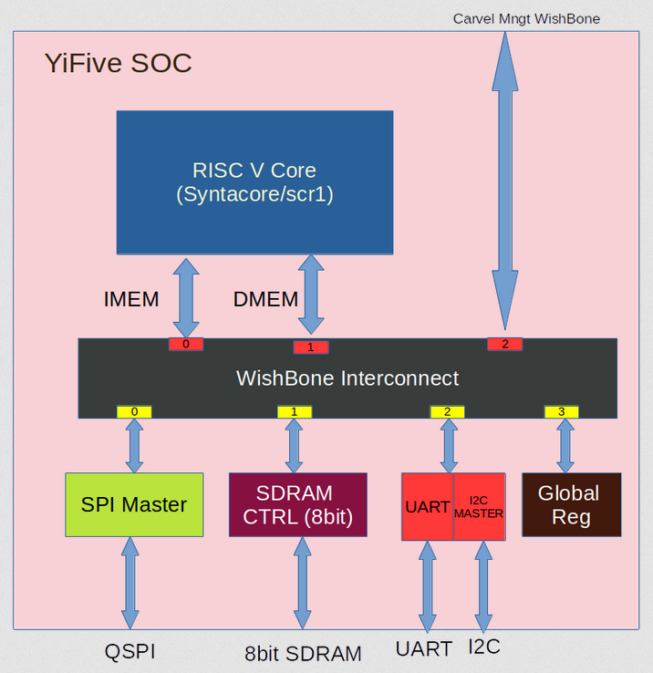
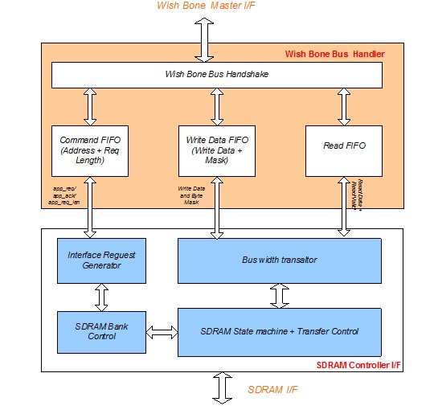

```
  YiFive SOC


Permission to use, copy, modify, and/or distribute this soc for any
purpose with or without fee is hereby granted, provided that the above
copyright notice and this permission notice appear in all copies.

THE SOC IS PROVIDED "AS IS" AND THE AUTHOR DISCLAIMS ALL WARRANTIES
WITH REGARD TO THIS SOC INCLUDING ALL IMPLIED WARRANTIES OF
MERCHANTABILITY AND FITNESS. IN NO EVENT SHALL THE AUTHOR BE LIABLE FOR
ANY SPECIAL, DIRECT, INDIRECT, OR CONSEQUENTIAL DAMAGES OR ANY DAMAGES
WHATSOEVER RESULTING FROM LOSS OF USE, DATA OR PROFITS, WHETHER IN AN
ACTION OF CONTRACT, NEGLIGENCE OR OTHER TORTIOUS ACTION, ARISING OUT OF
OR IN CONNECTION WITH THE USE OR PERFORMANCE OF THIS SOC.
```

# Table of contents
- [Overview](#overview)
- [YiFive Block Diagram](#yifive-block-diagram)
- [Key Feature](#key-features)
- [Sub IP Feature](#sub-ip-features)
- [Pin Mapping](#soc-pin-mapping)
- [Repository contents](#repository-contents)
- [Prerequisites](#prerequisites)
- [Tests preparation](#tests-preparation)
    - [Running Simuation](#running-simulation)
- [Tool sets](#tool-sets)
- [Documentation](#documentation)


# Overview

YiFive is a 32 bit RISC V based SOC design targeted for efebless Shuttle program.  This project uses only open source tool set for simulation,synthesis and backend tools.  The SOC flow follow the openlane methodology and SOC enviornment is compatible with efebless/carvel methodology.

# YiFive Block Diagram

<table>
  <tr>
    <td  align="center"></td>
  </tr>

</table>


# Key features
```
    * Open sourced under Apache-2.0 License (see LICENSE file) - unrestricted commercial use allowed
    * industry-grade and silicon-proven Open Source RISC-V core from syntacore 
    * industry-graded and silicon-proven 8 bit SDRAM controller
    * Quad SPI Master
    * Wishbone compatible design
    * Written in SystemVerilog
    * Open source tool set
       * similation - iverilog
       * synthesis  - yosys
       * backend/sta - openlane tool set
    * Verification suite provided
```

# Sub IP features

## RISC V Core

YiFive SOC Integrated Syntacore SCR1 Open-source RISV-V compatible MCU-class core.
It is industry-grade and silicon-proven IP. Git link: https://github.com/syntacore/scr1

### Block Diagram
<table>
  <tr>
    <td  align="center"></td>
  </tr>
</table>

### Key RISC V Core feature
```
   * RV32I or RV32E ISA base + optional RVM and RVC standard extensions
   * Machine privilege mode only
   * 2 to 4 stage pipeline
   * Optional Integrated Programmable Interrupt Controller with 16 IRQ lines
   * Optional RISC-V Debug subsystem with JTAG interface
   * Optional on-chip Tightly-Coupled Memory
```

### RISC V core changes in YiFive SOC
   YiFive Soc Modified the Syntacore RISCV source which is written in high level system verilog to basic verilog to compile/synthesis in open source tool like simulator (iverilog) and synthesis (yosys).
  


## 8bit SDRAM Controller
Due to number of pin limitation in carvel shuttle, YiFive SOC integrate 8bit SDRAM controller.
This is a silicon proven IP. IP Link: https://opencores.org/projects/sdr_ctrl

### Block Diagram
<table>
  <tr>
    <td  align="center"></td>
  </tr>
</table>

### key SDRAM Controller Feature
```
    * 8/16/32 Configurable SDRAM data width
    * Wish Bone compatible
    * Application clock and SDRAM clock can be async
    * Programmable column address
    * Support for industry-standard SDRAM devices and modules
    * Supports all standard SDRAM functions
    * Fully Synchronous; All signals registered on positive edge of system clock
    * One chip-select signals
    * Support SDRAM with four bank
    * Programmable CAS latency
    * Data mask signals for partial write operations
    * Bank management architecture, which minimizes latency
    * Automatic controlled refresh
```


# SOC Pin Mapping
Carvel SOC provides 38 GPIO pins for user functionality. YiFive SOC GPIO Pin Mapping as follows

<table>
  <tr>
    <td  align="center"> GPIO Pin Number</td> 
    <td  align="center"> Direction</td>
    <td  align="center"> Pad Name</td>
    <td  align="center"> Block Name</td>
  </tr>
  <tr>
    <td  align="center"> gpio[7:0]</td> 
    <td  align="center"> Inout</td>
    <td  align="center"> SDRAM Data [7:0]</td>
    <td  align="center"> SDRAM</td>
  </tr>
  <tr>
    <td  align="center"> gpio[20:8]</td> 
    <td  align="center"> Output</td>
    <td  align="center"> SDRAM Address [12:0]</td>
    <td  align="center"> SDRAM</td>
  </tr>
  <tr>
    <td  align="center"> gpio[22:21]</td> 
    <td  align="center"> Output</td>
    <td  align="center"> SDRAM Bank Select [1:0]</td>
    <td  align="center"> SDRAM</td>
  </tr>
  <tr>
    <td  align="center"> gpio[23]</td> 
    <td  align="center"> Output</td>
    <td  align="center"> SDRAM Byte Mask</td>
    <td  align="center"> SDRAM</td>
  </tr>
  <tr>
    <td  align="center"> gpio[24]</td> 
    <td  align="center"> Output</td>
    <td  align="center"> SDRAM Write Enable</td>
    <td  align="center"> SDRAM</td>
  </tr>
  <tr>
    <td  align="center"> gpio[25]</td> 
    <td  align="center"> Output</td>
    <td  align="center"> SDRAM CAS </td>
    <td  align="center"> SDRAM</td>
  </tr>
  <tr>
    <td  align="center"> gpio[26]</td> 
    <td  align="center"> Output</td>
    <td  align="center"> SDRAM RAS </td>
    <td  align="center"> SDRAM</td>
  </tr>
  <tr>
    <td  align="center"> gpio[27]</td> 
    <td  align="center"> Output</td>
    <td  align="center"> SDRAM Chip Select </td>
    <td  align="center"> SDRAM</td>
  </tr>
  <tr>
    <td  align="center"> gpio[28]</td> 
    <td  align="center"> Output</td>
    <td  align="center"> SDRAM CKE </td>
    <td  align="center"> SDRAM</td>
  </tr>
  <tr>
    <td  align="center"> gpio[29]</td> 
    <td  align="center"> Inout</td>
    <td  align="center"> SDRAM Clock</td>
    <td  align="center"> SDRAM</td>
  </tr>
  <tr>
    <td  align="center"> gpio[30]</td> 
    <td  align="center"> Output</td>
    <td  align="center"> SPI Clock</td>
    <td  align="center"> SPI</td>
  </tr>
  <tr>
    <td  align="center"> gpio[31]</td> 
    <td  align="center"> Output</td>
    <td  align="center"> SPI Chip Select</td>
    <td  align="center"> SPI</td>
  </tr>
  <tr>
    <td  align="center"> gpio[35:32]</td> 
    <td  align="center"> Inout</td>
    <td  align="center"> SPI Data</td>
    <td  align="center"> SPI</td>
  </tr>
  <tr>
    <td  align="center"> gpio[36]</td> 
    <td  align="center"> Output</td>
    <td  align="center"> Uart TX</td>
    <td  align="center"> UART</td>
  </tr>
  <tr>
    <td  align="center"> gpio[37]</td> 
    <td  align="center"> Output</td>
    <td  align="center"> Uart RX</td>
    <td  align="center"> UART</td>
  </tr>
</table>


# Repository contents

```
|verilog
|   ├─  rtl
|   |     |-  syntacore
|   |     |     |─  scr1
|   |     |     |    ├─ **docs**                           | **SCR1 documentation**
|   |     |     |    |      ├─ scr1_eas.pdf                | SCR1 External Architecture Specification
|   |     |     |    |      └─ scr1_um.pdf                 | SCR1 User Manual
|   |     |     |    |─  **src**                           | **SCR1 RTL source and testbench files**
|   |     |     |    |   ├─ includes                       | Header files
|   |     |     |    |   ├─ core                           | Core top source files
|   |     |     |    |   ├─ top                            | Cluster source files
|   |     |     |    |─  **synth**                         | **SCR1 RTL Synthesis files **
|   |     |- sdram_ctrl
|   |     |     |- **src**
|   |     |     |   |- **docs**                            | **SDRAM Controller Documentation**
|   |     |     |   |     |- sdram_controller_specs.pdf    | SDRAM Controller Design Specification
|   |     |     |   |             
|   |     |     |   |- core                                | SDRAM Core integration source files                          
|   |     |     |   |- defs                                | SDRAM Core defines
|   |     |     |   |- top                                 | SDRAM Top integration source files
|   |     |     |   |- wb2sdrc                             | SDRAM Wishbone source files
|   |     |- spi_master
|   |     |     |- src                                     | Qard SPI Master Source files
|   |     |-wb_interconnect
|   |     |     |- src                                     | 3x4 Wishbone Interconnect
|   |     |- digital_core
|   |     |     |- src                                     | Digital core Source files
|   |     |- lib                                           | common library source files
|   |- dv
|   |   |- la_test1                                        | carevel LA test
|   |   |- risc_boot                                       | user core risc boot test
|   |   |- wb_port                                         | user wishbone test
|   |   |- user_risc_boot                                  | user standalone test without carevel soc
|   |- gl                                                  | ** GLS Source files **
|
|- openlane
    |- sdram                                               | sdram openlane scripts   
    |- spi_master                                          | spi_master openlane scripts   
    |- syntacore                                           | Risc Core openlane scripts   
    |- yifive                                              | yifive digital core openlane scripts
    |- user_project_wrapper                                | carvel user project wrapper 

```


# Prerequisites
   - Docker (ensure docker daemon is running) -- tested with version 19.03.12, but any recent version should suffice

## Environment setting

```bash
    export CARAVEL_ROOT=<Carvel Installed Path>
    export OPENLANE_ROOT=<OpenLane Installed Path>
    export PDK_ROOT=<PDK Installed Path>
    export IMAGE_NAME=efabless/openlane:rc7
```

# Tests preparation

The simulation package includes the following tests:

* **risc_boot**      - Simple User Risc core boot 
* **wb_port**        - User Wishbone validation
* **user_risc_boot** - Standalone User Risc core boot


# Running Simuation

Examples:
``` sh
    make verify-wb_port  
    make verify-risc_hello
```

# Tool Sets

Soc flow uses Openlane tool sets.

1. **Synthesis**
    1. `yosys` - Performs RTL synthesis
    2. `abc` - Performs technology mapping
    3. `OpenSTA` - Pefroms static timing analysis on the resulting netlist to generate timing reports
2. **Floorplan and PDN**
    1. `init_fp` - Defines the core area for the macro as well as the rows (used for placement) and the tracks (used for routing)
    2. `ioplacer` - Places the macro input and output ports
    3. `pdn` - Generates the power distribution network
    4. `tapcell` - Inserts welltap and decap cells in the floorplan
3. **Placement**
    1. `RePLace` - Performs global placement
    2. `Resizer` - Performs optional optimizations on the design
    3. `OpenPhySyn` - Performs timing optimizations on the design
    4. `OpenDP` - Perfroms detailed placement to legalize the globally placed components
4. **CTS**
    1. `TritonCTS` - Synthesizes the clock distribution network (the clock tree)
5. **Routing**
    1. `FastRoute` - Performs global routing to generate a guide file for the detailed router
    2. `CU-GR` - Another option for performing global routing.
    3. `TritonRoute` - Performs detailed routing
    4. `SPEF-Extractor` - Performs SPEF extraction
6. **GDSII Generation**
    1. `Magic` - Streams out the final GDSII layout file from the routed def
    2. `Klayout` - Streams out the final GDSII layout file from the routed def as a back-up
7. **Checks**
    1. `Magic` - Performs DRC Checks & Antenna Checks
    2. `Klayout` - Performs DRC Checks
    3. `Netgen` - Performs LVS Checks
    4. `CVC` - Performs Circuit Validity Checks


## **importent Note**

Following tools in openlane docker is older version, we need to update these tool set.
* Icarus Verilog version 12.0 (devel) (s20150603-1107-ga446c34d)
* Yosys 0.9+4081 (git sha1 b6721aa9, clang 10.0.0-4ubuntu1 -fPIC -Os)


## Contacts

Report an issue: <https://github.com/dineshannayya/yifive_r0/issues>

# Documentation
    * Syntacore Link: https://github.com/syntacore/scr1
    * SDRAM Controller : https://opencores.org/projects/sdr_ctrl


