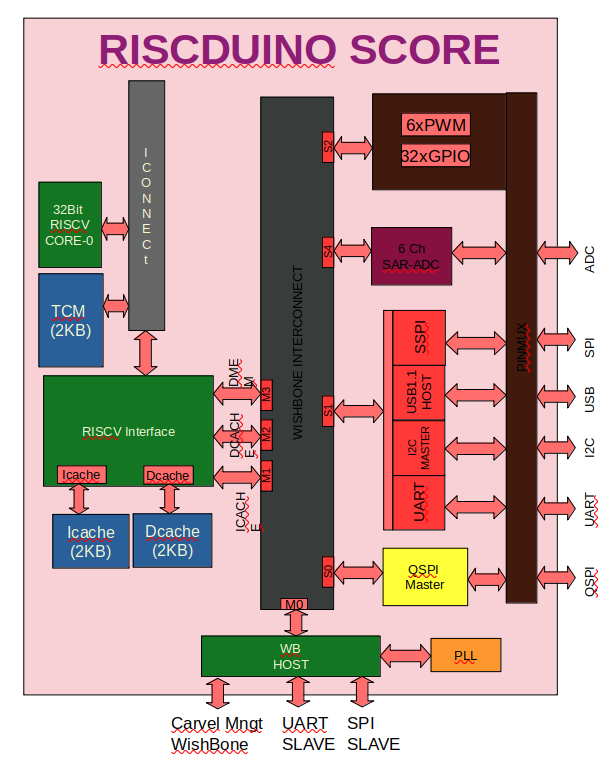
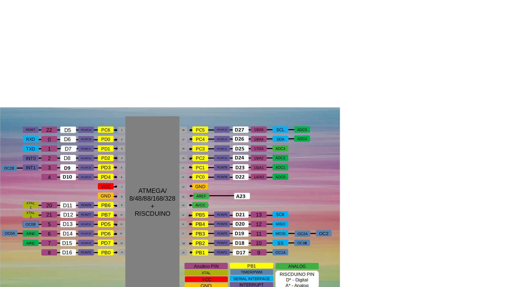
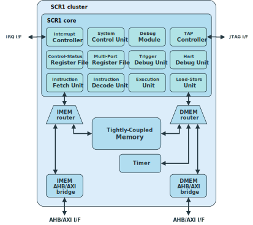

```
  Riscduino SOC


Permission to use, copy, modify, and/or distribute this soc for any
purpose with or without fee is hereby granted, provided that the above
copyright notice and this permission notice appear in all copies.

THE SOC IS PROVIDED "AS IS" AND THE AUTHOR DISCLAIMS ALL WARRANTIES
WITH REGARD TO THIS SOC INCLUDING ALL IMPLIED WARRANTIES OF
MERCHANTABILITY AND FITNESS. IN NO EVENT SHALL THE AUTHOR BE LIABLE FOR
ANY SPECIAL, DIRECT, INDIRECT, OR CONSEQUENTIAL DAMAGES OR ANY DAMAGES
WHATSOEVER RESULTING FROM LOSS OF USE, DATA OR PROFITS, WHETHER IN AN
ACTION OF CONTRACT, NEGLIGENCE OR OTHER TORTIOUS ACTION, ARISING OUT OF
OR IN CONNECTION WITH THE USE OR PERFORMANCE OF THIS SOC.
```

# Table of contents
- [Overview](#overview)
- [Riscduino Block Diagram](#Riscduino-block-diagram)
- [Key Feature](#key-features)
- [Sub IP Feature](#sub-ip-features)
- [SOC Memory Map](#soc-memory-map)
- [Pin Mapping](#soc-pin-mapping)
- [Repository contents](#repository-contents)
- [Prerequisites](#prerequisites)
- [Tests preparation](#tests-preparation)
    - [Running Simuation](#running-simulation)
- [Tool sets](#tool-sets)
- [Documentation](#documentation)


# Overview

Riscduino is a 32 bit RISC V based SOC design pin compatible to arudino platform and this soc targetted for efabless Shuttle program.  This project uses only open source tool set for simulation,synthesis and backend tools.  The SOC flow follow the openlane methodology and SOC environment is compatible with efabless/carvel methodology.

# Riscduino Block Diagram

<table>
  <tr>
    <td  align="center"></td>
  </tr>

</table>


# Key features
```
    * Open sourced under Apache-2.0 License (see LICENSE file) - unrestricted commercial use allowed.
    * industry-grade and silicon-proven Open-Source RISC-V core from syntacore 
    * 4KB SRAM for data memory
    * 8KB SRAM for program memory
    * Quad SPI Master
    * UART with 16Byte FIFO
    * USB 1.1 Host
    * I2C Master
    * Simple SPI Master
    * MBIST controller for 8KB Program memory
    * 6 Channel ADC (in Progress)
    * 6 PWM
    * Pin Compatbible to arudino uno
    * Wishbone compatible design
    * Written in System Verilog
    * Open-source tool set
       * simulation - iverilog
       * synthesis  - yosys
       * backend/sta - openlane tool set
    * Verification suite provided.
```

# SOC Pin Mapping
Carvel SOC provides 38 GPIO pins for user functionality. Riscduino SOC GPIO Pin Mapping as follows vs ATMEGA328 and Arudino
<table>
  <tr>
    <td  align="center"></td>
  </tr>

</table>

<table>
  <tr align="center"> <td> ATMGA328 Pin No</td> <td> Functionality           </td> <td> Arudino Pin Name</td> <td> Carvel Pin Mapping                   </td></tr>
  <tr align="center"> <td> Pin-1           </td> <td> PC6/RESET              </td> <td>                 </td> <td> digital_io[0]                        </td></tr>
  <tr align="center"> <td> Pin-2           </td> <td> PD0/RXD                </td> <td>  D0             </td> <td> digital_io[1]                        </td></tr>
  <tr align="center"> <td> Pin-3           </td> <td> PD1/TXD                </td> <td>  D1             </td> <td> digital_io[2]                        </td></tr>
  <tr align="center"> <td> Pin-4           </td> <td> PD2/INT0               </td> <td>  D2             </td> <td> digital_io[3]                        </td></tr>
  <tr align="center"> <td> Pin-5           </td> <td> PD3/INT1/OC2B(PWM0)    </td> <td>  D3             </td> <td> digital_io[4]                        </td></tr>
  <tr align="center"> <td> Pin-6           </td> <td> PD4                    </td> <td>  D4             </td> <td> digital_io[5]                        </td></tr>
  <tr align="center"> <td> Pin-7           </td> <td> VCC                    </td> <td>                 </td> <td>  -                                   </td></tr>
  <tr align="center"> <td> Pin-8           </td> <td> GND                    </td> <td>                 </td> <td>  -                                   </td></tr>
  <tr align="center"> <td> Pin-9           </td> <td> PB6/XTAL1/TOSC1        </td> <td>                 </td> <td> digital_io[6]                        </td></tr>
  <tr align="center"> <td> Pin-10          </td> <td> PB7/XTAL2/TOSC2        </td> <td>                 </td> <td> digital_io[7]                        </td></tr>
  <tr align="center"> <td> Pin-11          </td> <td> PD5/OC0B(PWM1)/T1      </td> <td> D5              </td> <td> digital_io[8]                        </td></tr>
  <tr align="center"> <td> Pin-12          </td> <td> PD6/OC0A(PWM2)/AIN0    </td> <td> D6              </td> <td> digital_io[9] /analog_io[2]          </td></tr>
  <tr align="center"> <td> Pin-13          </td> <td> PD7/A1N1               </td> <td> D7              </td> <td> digital_io[10]/analog_io[3]          </td></tr>
  <tr align="center"> <td> Pin-14          </td> <td> PB0/CLKO/ICP1          </td> <td> D8              </td> <td> digital_io[11]                       </td></tr>
  <tr align="center"> <td> Pin-15          </td> <td> PB1/OC1A(PWM3)         </td> <td> D9              </td> <td> digital_io[12]                       </td></tr>
  <tr align="center"> <td> Pin-16          </td> <td> PB2/SS/OC1B(PWM4)      </td> <td> D10             </td> <td> digital_io[13]                       </td></tr>
  <tr align="center"> <td> Pin-17          </td> <td> PB3/MOSI/OC2A(PWM5)    </td> <td> D11             </td> <td> digital_io[14]                       </td></tr>
  <tr align="center"> <td> Pin-18          </td> <td> PB4/MISO               </td> <td> D12             </td> <td> digital_io[15]                       </td></tr>
  <tr align="center"> <td> Pin-19          </td> <td> PB5/SCK                </td> <td> D13             </td> <td> digital_io[16]                       </td></tr>
  <tr align="center"> <td> Pin-20          </td> <td> AVCC                   </td> <td>                 </td> <td> -                                    </td></tr>
  <tr align="center"> <td> Pin-21          </td> <td> AREF                   </td> <td>                 </td> <td> analog_io[10]                        </td></tr>
  <tr align="center"> <td> Pin-22          </td> <td> GND                    </td> <td>                 </td> <td> -                                    </td></tr>
  <tr align="center"> <td> Pin-23          </td> <td> PC0/ADC0               </td> <td>  A0             </td> <td> digital_io[18]/analog_io[11]         </td></tr>
  <tr align="center"> <td> Pin-24          </td> <td> PC1/ADC1               </td> <td>  A1             </td> <td> digital_io[19]/analog_io[12]         </td></tr>
  <tr align="center"> <td> Pin-25          </td> <td> PC2/ADC2               </td> <td>  A2             </td> <td> digital_io[20]/analog_io[13]         </td></tr>
  <tr align="center"> <td> Pin-26          </td> <td> PC3/ADC3               </td> <td>  A3             </td> <td> digital_io[21]/analog_io[14]         </td></tr>
  <tr align="center"> <td> Pin-27          </td> <td> PC4/ADC4/SDA           </td> <td>  A4             </td> <td> digital_io[22]/analog_io[15]         </td></tr>
  <tr align="center"> <td> Pin-28          </td> <td> PC5/ADC5/SCL           </td> <td>  A5             </td> <td> digital_io[23]/analog_io[16]         </td></tr>
  <tr align="center"> <td colspan="4">   Additional Pad used for Externam ROM/RAM/USB </td></tr>
  <tr align="center"> <td> Sflash          </td> <td> sflash_sck             </td> <td>                 </td> <td> digital_io[24]                       </td></tr>
  <tr align="center"> <td> SFlash          </td> <td> sflash_ss              </td> <td>                 </td> <td> digital_io[25]                       </td></tr>
  <tr align="center"> <td> SFlash          </td> <td> sflash_io0             </td> <td>                 </td> <td> digital_io[26]                       </td></tr>
  <tr align="center"> <td> SFlash          </td> <td> sflash_io1             </td> <td>                 </td> <td> digital_io[27]                       </td></tr>
  <tr align="center"> <td> SFlash          </td> <td> sflash_io2             </td> <td>                 </td> <td> digital_io[28]                       </td></tr>
  <tr align="center"> <td> SFlash          </td> <td> sflash_io3             </td> <td>                 </td> <td> digital_io[29]                       </td></tr>
  <tr align="center"> <td> SSRAM           </td> <td> Reserved               </td> <td>                 </td> <td> digital_io[30]                       </td></tr>
  <tr align="center"> <td> SSRAM           </td> <td> Reserved               </td> <td>                 </td> <td> digital_io[31]                       </td></tr>
  <tr align="center"> <td> SSRAM           </td> <td> Reserved               </td> <td>                 </td> <td> digital_io[32]                       </td></tr>
  <tr align="center"> <td> SSRAM           </td> <td> Reserved               </td> <td>                 </td> <td> digital_io[33]                       </td></tr>
  <tr align="center"> <td> SSRAM           </td> <td> uartm rxd              </td> <td>                 </td> <td> digital_io[34]                       </td></tr>
  <tr align="center"> <td> SSRAM           </td> <td> uartm txd              </td> <td>                 </td> <td> digital_io[35]                       </td></tr>
  <tr align="center"> <td> usb1.1          </td> <td> usb_dp                 </td> <td>                 </td> <td> digital_io[36]                       </td></tr>
  <tr align="center"> <td> usb1.1          </td> <td> usb_dn                 </td> <td>                 </td> <td> digital_io[37]                       </td></tr>
</table>
# Sub IP features

## RISC V Core

Riscduino SOC Integrated Syntacore SCR1 Open-source RISV-V compatible MCU-class core.
It is industry-grade and silicon-proven IP. Git link: https://github.com/syntacore/scr1

### Block Diagram
<table>
  <tr>
    <td  align="center"></td>
  </tr>
</table>

### RISC V Core Key feature
```
   * RV32I or RV32E ISA base + optional RVM and RVC standard extensions
   * Machine privilege mode only
   * 2 to 4 stage pipeline
   * Optional Integrated Programmable Interrupt Controller with 16 IRQ lines
   * Optional RISC-V Debug subsystem with JTAG interface
   * Optional on-chip Tightly-Coupled Memory
```

### RISC V core customization Riscduino SOC
  

* **Update**: Modified some of the system verilog syntax to basic verilog syntax to compile/synthesis in open source tool like simulator (iverilog) and synthesis (yosys).
* **Modification**: Modified the AXI/AHB interface to wishbone interface towards instruction & data memory interface


# SOC Memory Map

<table>
  <tr>
    <td  align="center"> RISC IMEM</td> 
    <td  align="center"> RISC DMEM</td>
    <td  align="center"> EXT MAP</td>
    <td  align="center"> Target IP</td>
  </tr>
  <tr>
    <td  align="center"> 0x0000_0000 to 0x0FFF_FFFF  </td> 
    <td  align="center"> 0x0000_0000 to 0x0FFF_FFFF  </td>
    <td  align="center"> 0x0000_0000 to 0x0FFF_FFFF</td>
    <td  align="center"> QSPI FLASH MEMORY</td>
  </tr>
  <tr>
    <td  align="center"> 0x1000_0000 to 0x1000_00FF</td> 
    <td  align="center"> 0x1000_0000 to 0x1000_00FF</td>
    <td  align="center"> 0x1000_0000 to 0x1000_00FF</td>
    <td  align="center"> QSPI Config Reg</td>
  </tr>
  <tr>
    <td  align="center"> 0x1001_0000 to 0x1001_003F</td> 
    <td  align="center"> 0x1001_0000 to 0x1001_003F</td>
    <td  align="center"> 0x1001_0000 to 0x1001_003F</td>
    <td  align="center"> UART</td>
  </tr>
  <tr>
    <td  align="center"> 0x1001_0040 to 0x1001_007F</td> 
    <td  align="center"> 0x1001_0040 to 0x1001_007F</td>
    <td  align="center"> 0x1001_0040 to 0x1001_007F</td>
    <td  align="center"> I2C</td>
  </tr>
  <tr>
    <td  align="center"> 0x1001_0080 to 0x1001_00BF</td> 
    <td  align="center"> 0x1001_0080 to 0x1001_00BF</td>
    <td  align="center"> 0x1001_0080 to 0x1001_00BF</td>
    <td  align="center"> USB</td>
  </tr>
  <tr>
    <td  align="center"> 0x1001_00C0 to 0x1001_00FF</td> 
    <td  align="center"> 0x1001_00C0 to 0x1001_00FF</td>
    <td  align="center"> 0x1001_00C0 to 0x1001_00FF</td>
    <td  align="center"> SSPI</td>
  </tr>
  <tr>
    <td  align="center"> 0x1002_0080 to 0x1002_00FF</td> 
    <td  align="center"> 0x1002_0080 to 0x1002_00FF</td>
    <td  align="center"> 0x1002_0080 to 0x1002_00FF</td>
    <td  align="center"> PINMUX</td>
  </tr>
  <tr>
    <td  align="center"> 0x1003_0080 to 0x1003_07FF</td> 
    <td  align="center"> 0x1003_0080 to 0x1003_07FF</td>
    <td  align="center"> 0x1003_0080 to 0x1003_07FF</td>
    <td  align="center"> SRAM-0 (2KB)</td>
  </tr>
  <tr>
    <td  align="center"> 0x1003_0800 to 0x1003_0FFF</td> 
    <td  align="center"> 0x1003_0800 to 0x1003_0FFF</td>
    <td  align="center"> 0x1003_0800 to 0x1003_0FFF</td>
    <td  align="center"> SRAM-1 (2KB)</td>
  </tr>
  <tr>
    <td  align="center"> 0x1003_1000 to 0x1003_17FF</td> 
    <td  align="center"> 0x1003_1000 to 0x1003_17FF</td>
    <td  align="center"> 0x1003_1000 to 0x1003_17FF</td>
    <td  align="center"> SRAM-2 (2KB)</td>
  </tr>
  <tr>
    <td  align="center"> 0x1003_1800 to 0x1003_1FFF</td> 
    <td  align="center"> 0x1003_1800 to 0x1003_1FFF</td>
    <td  align="center"> 0x1003_1800 to 0x1003_1FFF</td>
    <td  align="center"> SRAM-3 (2KB)</td>
  </tr>
  <tr>
    <td  align="center"> -</td> 
    <td  align="center"> -</td>
    <td  align="center"> 0x3080_0000 to 0x3080_00FF</td>
    <td  align="center"> WB HOST</td>
  </tr>
</table>

# SOC Size

| Block             | Total Cell | Seq      | Combo   |
| ------            | ---------  | -------- | -----   |
| RISC              | 20982      | 3164     | 17818   |
| PINMUX            | 5693       | 1022     |  4671   |
| SPI               | 7120       | 1281     |  5839   |
| UART_I2C_USB_SPI  | 11196      | 2448     |  8748   |
| WB_HOST           | 2796       | 588      |  2208   |
| WB_INTC           | 1878       | 108      |  1770   |
| SAR_ADC           | 118        |  18      |   100   |
| MBIST             | 3125       | 543      |  2582   |
|                   |            |          |         |
| TOTAL             | 52908      | 9172     | 43736   |


# SOC Register Map
##### Register Map: Wishbone HOST

| Offset | Name       | Description   |
| ------ | ---------  | ------------- |
| 0x00   | GLBL_CTRL  | [RW] Global Wishbone Access Control Register |
| 0x04   | BANK_CTRL  | [RW] Bank Selection, MSB 8 bit Address |
| 0x08   | CLK_SKEW_CTRL1| [RW] Clock Skew Control2 |
| 0x0c   | CLK_SKEW_CTRL2 | [RW] Clock Skew Control2 |

##### Register: GLBL_CTRL

| Bits  | Name          | Description    |
| ----  | ----          | -------------- |
| 31:24 | Resevered     | Unsused |
| 23:20 | RTC_CLK_CTRL  | RTC Clock Div Selection |
| 19:16 | CPU_CLK_CTRL  | CPU Clock Div Selection |
| 15:12 | SDARM_CLK_CTRL| SDRAM Clock Div Selection |
| 10:8  | WB_CLK_CTRL   | Core Wishbone Clock Div Selection |
|   7   | UART_I2C_SEL  | 0 - UART , 1 - I2C Master IO Selection |
|   5   | I2C_RST       | I2C Reset Control |
|   4   | UART_RST      | UART Reset Control |
|   3   | SDRAM_RST     | SDRAM Reset Control |
|   2   | SPI_RST       | SPI Reset Control |
|   1   | CPU_RST       | CPU Reset Control |
|   0   | WB_RST        | Wishbone Core Reset Control |

##### Register: BANK_CTRL

| Bits  | Name          | Description    |
| ----  | ----          | -------------- |
| 31:24 | Resevered     | Unsused |
| 7:0   | BANK_SEL      | Holds the upper 8 bit address core Wishbone Address |

##### Register: CLK_SKEW_CTRL1

| Bits  | Name          | Description    |
| ----  | ----          | -------------- |
| 31:28 | Resevered     | Unsused |
| 27:24 | CLK_SKEW_WB   | WishBone Core Clk Skew Control |
| 23:20 | CLK_SKEW_GLBL | Glbal Register Clk Skew Control |
| 19:16 | CLK_SKEW_SDRAM| SDRAM Clk Skew Control |
| 15:12 | CLK_SKEW_SPI  | SPI Clk Skew Control |
| 11:8  | CLK_SKEW_UART | UART/I2C Clk Skew Control |
| 7:4   | CLK_SKEW_RISC | RISC Clk Skew Control |
| 3:0   | CLK_SKEW_WI   | Wishbone Clk Skew Control |

##### Register Map: SPI MASTER

| Offset | Name       | Description   |
| ------ | ---------  | ------------- |
| 0x00   | GLBL_CTRL  | [RW] Global SPI Access Control Register |
| 0x04   | DMEM_CTRL1 | [RW] Direct SPI Memory Access Control Register1 |
| 0x08   | DMEM_CTRL2 | [RW] Direct SPI Memory Access Control Register2 |
| 0x0c   | IMEM_CTRL1 | [RW] Indirect SPI Memory Access Control Register1 |
| 0x10   | IMEM_CTRL2 | [RW] Indirect SPI Memory Access Control Register2 |
| 0x14   | IMEM_ADDR  | [RW] Indirect SPI Memory Address  |
| 0x18   | IMEM_WDATA | [W]  Indirect SPI Memory Write Data |
| 0x1c   | IMEM_RDATA | [R]  Indirect SPI Memory Read Data |
| 0x20   | SPI_STATUS | [R] SPI Debug Status |

##### Register: GLBL_CTRL

| Bits  | Name        | Description    |
| ----  | ----        | -------------- |
| 31:16 | Resevered   | Unsused |
| 15:8  | SPI_CLK_DIV | SPI Clock Div Rato Selection |
| 7:4   | Reserved    | Unused |
| 3:2   | CS_LATE     | CS DE_ASSERTION CONTROL |
| 1:0   | CS_EARLY    | CS ASSERTION CONTROL |

##### Register: DMEM_CTRL1

| Bits | Name       | Description    |
| ---- | ----       | -------------- |
| 31:9 | Resevered  | Unsused        |
| 8    | FSM_RST    | Direct Mem State Machine Reset |
| 7:6  | SPI_SWITCH | Phase at which SPI Mode need to switch |
| 5:4  | SPI_MODE   | SPI Mode, 0 - Single, 1 - Dual, 2 - Quad, 3 - QDDR |
| 3:0  | CS_SELECT  | CHIP SELECT |

##### Register: DMEM_CTRL2

| Bits | Name       | Description    |
| ---- | ----       | -------------- |
| 31:24 | DATA_CNT  | Total Data Byte Count        |
| 23:22 | DUMMY_CNT | Total Dummy Byte Count |
| 21:20 | ADDR_CNT  | Total Address Byte Count |
| 19:16 | SPI_SEQ   | SPI Access Sequence |
| 15:8  | MODE_REG  | Mode Register Value |
| 7:0   | CMD_REG   | Command Register Value |

##### Register: IMEM_CTRL1

| Bits | Name       | Description    |
| ---- | ----       | -------------- |
| 31:9 | Resevered  | Unsused        |
| 8    | FSM_RST    | InDirect Mem State Machine Reset |
| 7:6  | SPI_SWITCH | Phase at which SPI Mode need to switch |
| 5:4  | SPI_MODE   | SPI Mode, 0 - Single, 1 - Dual, 2 - Quad, 3 - QDDR |
| 3:0  | CS_SELECT  | CHIP SELECT |

##### Register: IMEM_CTRL2

| Bits | Name       | Description    |
| ---- | ----       | -------------- |
| 31:24 | DATA_CNT  | Total Data Byte Count        |
| 23:22 | DUMMY_CNT | Total Dummy Byte Count |
| 21:20 | ADDR_CNT  | Total Address Byte Count |
| 19:16 | SPI_SEQ   | SPI Access Sequence |
| 15:8  | MODE_REG  | Mode Register Value |
| 7:0   | CMD_REG   | Command Register Value |

##### Register: IMEM_ADDR

| Bits | Name       | Description    |
| ---- | ----       | -------------- |
| 31:0 | ADDR       | Indirect Memory Address  |

##### Register: IMEM_WDATA

| Bits | Name       | Description    |
| ---- | ----       | -------------- |
| 31:0 | WDATA      | Indirect Memory Write Data  |

##### Register: IMEM_RDATA

| Bits | Name       | Description    |
| ---- | ----       | -------------- |
| 31:0 | RDATA      | Indirect Memory Read Data  |

##### Register: SPI_STATUS

| Bits | Name       | Description    |
| ---- | ----       | -------------- |
| 31:0 | DEBUG      | SPI Debug Status  |


##### Register Map: Global Register

| Offset | Name        | Description   |
| ------ | ---------   | ------------- |
| 0x00   | SOFT_REG0   | [RW] Software Register0 |
| 0x04   | RISC_FUSE   | [RW] Risc Fuse Value  |
| 0x08   | SOFT_REG2   | [RW] Software Register2 |
| 0x0c   | INTR_CTRL   | [RW] Interrupt Control |
| 0x10   | SDRAM_CTRL1 | [RW] Indirect SPI Memory Access Control Register2 |
| 0x14   | SDRAM_CTRL2 | [RW] Indirect SPI Memory Address  |
| 0x18   | SOFT_REG6   | [RW] Software Register6 |
| 0x1C   | SOFT_REG7   | [RW] Software Register7 |
| 0x20   | SOFT_REG8   | [RW] Software Register8 |
| 0x24   | SOFT_REG9   | [RW] Software Register9 |
| 0x28   | SOFT_REG10  | [RW] Software Register10 |
| 0x2C   | SOFT_REG11  | [RW] Software Register11 |
| 0x30   | SOFT_REG12  | [RW] Software Register12 |
| 0x34   | SOFT_REG13  | [RW] Software Register13 |
| 0x38   | SOFT_REG14  | [RW] Software Register14 |
| 0x3C   | SOFT_REG15  | [RW] Software Register15 |

##### Register: RISC_FUSE

| Bits  | Name        | Description    |
| ----  | ----        | -------------- |
| 31:0  | RISC_FUSE   | RISC Core Fuse Value |

##### Register: INTR_CTRL

| Bits  | Name        | Description    |
| ----  | ----        | -------------- |
| 31:20 | Reserved    | Unused         |
| 19:17 | USER_IRQ    | User Interrupt generation toward riscv         |
| 16    | SOFT_IRQ    | Software Interrupt generation toward riscv     |
| 15:0  | EXT_IRQ     | External Interrupt generation toward riscv     |


# Repository contents

```
|verilog
|   ├─  rtl
|   |     |-  syntacore
|   |     |     |─  scr1
|   |     |     |    ├─ **docs**                           | **SCR1 documentation**
|   |     |     |    |      ├─ scr1_eas.pdf                | SCR1 External Architecture Specification
|   |     |     |    |      └─ scr1_um.pdf                 | SCR1 User Manual
|   |     |     |    |─  **src**                           | **SCR1 RTL source and testbench files**
|   |     |     |    |   ├─ includes                       | Header files
|   |     |     |    |   ├─ core                           | Core top source files
|   |     |     |    |   ├─ top                            | Cluster source files
|   |     |     |    |─  **synth**                         | **SCR1 RTL Synthesis files **
|   |     |- Qspi_master
|   |     |     |- src                                     | Qard SPI Master Source files
|   |     |-wb_interconnect
|   |     |     |- src                                     | 3x4 Wishbone Interconnect
|   |     |- digital_core
|   |     |     |- src                                     | Digital core Source files
|   |     |- lib                                           | common library source files
|   |- dv
|   |   |- la_test1                                        | carevel LA test
|   |   |- risc_boot                                       | user core risc boot test
|   |   |- wb_port                                         | user wishbone test
|   |   |- user_risc_boot                                  | user standalone test without carevel soc
|   |- gl                                                  | ** GLS Source files **
|
|- openlane
    |- spi_master                                          | spi_master openlane scripts   
    |- syntacore                                           | Risc Core openlane scripts   
    |- user_project_wrapper                                | carvel user project wrapper 

```


# Prerequisites
   - Docker (ensure docker daemon is running) -- tested with version 19.03.12, but any recent version should suffice.
## Step-1: Docker in ubuntu 20.04 version
```bash
   sudo apt update
   sudo apt-get install apt-transport-https curl rtificates -agent software-properties-common
   curl -fsSL https://download.docker.com/linux/ubuntu/gpg | sudo apt-key add -
   sudo add-apt-repository "deb [arch=amd64] https://download.docker.com/linux/ubuntu focal stable"
   sudo apt update
   apt-cache policy docker-ce
   sudo apt install docker-ce

   #Add User Name to docker
   sudo usermod -aG docker <your user name>
   # Reboot the system to enable the docker setup
```
##  Step-2: Update the Submodule, To to project area
```bash
   git submodule init
   git submodule update
```
## Step-3: clone Openlane scripts under workarea
```bash
   git clone https://github.com/The-OpenROAD-Project/OpenLane.git
```

## Step-4: add Environment setting
```bash
    export CARAVEL_ROOT=<Carvel Installed Path>
    export OPENLANE_ROOT=<OpenLane Installed Path>
    export OPENLANE_IMAGE_NAME=efabless/openlane:latest
    export PDK_ROOT=<PDK Installed PATH>
    export PDK_PATH=<PDK Install Path>/sky130A
```
## Step-5: To install the PDK
```bash
   source ~/.bashrc
   cd OpenLane
   make pdk
```

# Tests preparation

The simulation package includes the following tests:

* **risc_boot**           - Simple User Risc core boot 
* **wb_port**             - User Wishbone validation
* **user_risc_boot**      - Standalone User Risc core boot
* **user_mbist_test1**    - Standalone MBIST test
* **user_spi**            - Standalone SPI test
* **user_i2c**            - Standalone I2C test
* **user_risc_soft_boot** - Standalone Risc with SRAM as Boot


# Running Simulation

Examples:
``` sh
    make verify-wb_port  
    make verify-risc_boot
    make verify-user_uart
    make verify-user_spi
    make verify-user_i2cm
    make verify-user_risc_boot
    make verify-wb_port SIM=RTL DUMP=OFF
    make verify-wb_port SIM=RTL DUMP=ON
    make verify-riscv_regress
```

# Tool Sets

Riscduino Soc flow uses Openlane tool sets.

1. **Synthesis**
    1. `yosys` - Performs RTL synthesis
    2. `abc` - Performs technology mapping
    3. `OpenSTA` - Pefroms static timing analysis on the resulting netlist to generate timing reports
2. **Floorplan and PDN**
    1. `init_fp` - Defines the core area for the macro as well as the rows (used for placement) and the tracks (used for routing)
    2. `ioplacer` - Places the macro input and output ports
    3. `pdn` - Generates the power distribution network
    4. `tapcell` - Inserts welltap and decap cells in the floorplan
3. **Placement**
    1. `RePLace` - Performs global placement
    2. `Resizer` - Performs optional optimizations on the design
    3. `OpenPhySyn` - Performs timing optimizations on the design
    4. `OpenDP` - Perfroms detailed placement to legalize the globally placed components
4. **CTS**
    1. `TritonCTS` - Synthesizes the clock distribution network (the clock tree)
5. **Routing**
    1. `FastRoute` - Performs global routing to generate a guide file for the detailed router
    2. `CU-GR` - Another option for performing global routing.
    3. `TritonRoute` - Performs detailed routing
    4. `SPEF-Extractor` - Performs SPEF extraction
6. **GDSII Generation**
    1. `Magic` - Streams out the final GDSII layout file from the routed def
    2. `Klayout` - Streams out the final GDSII layout file from the routed def as a back-up
7. **Checks**
    1. `Magic` - Performs DRC Checks & Antenna Checks
    2. `Klayout` - Performs DRC Checks
    3. `Netgen` - Performs LVS Checks
    4. `CVC` - Performs Circuit Validity Checks


## Contacts

Report an issue: <https://github.com/dineshannayya/riscduino/issues>

# Documentation
* **Syntacore Link** - https://github.com/syntacore/scr1


